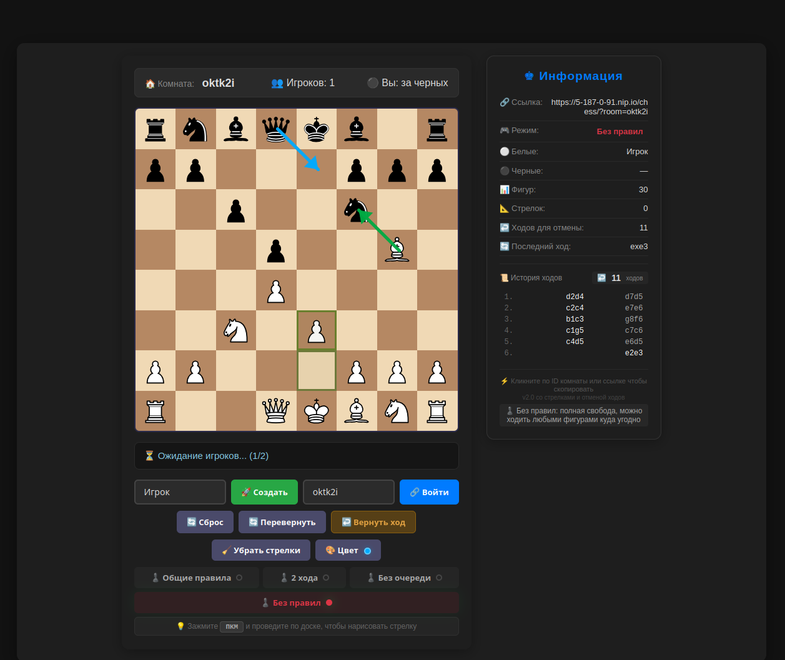

# Шахматы Песочница (Chess Sandbox Game)

Онлайн площадка для обучения и игры в шахматы. 

1. Реализована проверка правил ходов, а также возможность играть без правил (есть кнопка отключения правил), 
    показывая сопернику хорошие ходы. 
    Без правил можно делать любые ходы за себя и за соперника. 
2. Пока что, можно делать несколько ходов подряд за один цвет, даже, если играешь по правилам. 
    Проверка на очередность ходов ещё не реализована.
3. Любой из своих ходов и ходов сопеника можно всегда отменить. 
4. Реализована подсветка последнего хода. 
5. Реализована подсветка шаха. 
6. Добавлена возможность рисовать стрелки с зажатой правой кнопкой мыши. 
    Стрелки видны всем игрокам.
    Возможность выбора цвета стрелок, удаление всех стрелок кнопкой на панели.  
7.  В простейшем виде реализована история ходов.

## Для старта игры - нажать кнопку "Cоздать", создается комната для игроков, 
далее нажать на ссылку на комнату, ссылка должна скопироваться в буфер, и её можно отправлять соперникам и зрителям по игре.

## To Do:

1. Реализовать проверку очередности ходов в режиме игры по правилам. 
2. Реализовать превращение пешки в любую из фигур, если она дошла до последней линии. 
3. Сделать проверку на наличие битых полей перед рокировкой. 
4. Исправить надписи "за белых" или "за черных". 
5. Добавить возможность копирования нотации в стандартном формате. 
6. Прикрутить базы данных PostgreSQL, для хранения партий. 

